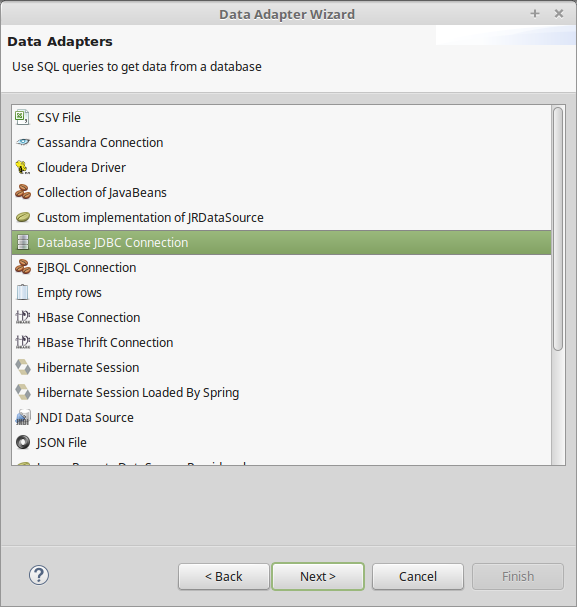

# Sinau Java Desktop 2 - Advanced #

## [PERTEMUAN 1] ##

Selamat datang disesi Java Advanced. Pada kesempatan kali ini kita akan mendalami tentang data access design pattern dan reporting di Java.

## DAO / Data Accessing Object ##

DAO merupakan sebuah design pattern yang berguna untuk mengakses data didalam database. Pada modul Java basic 1 kita telah belajar mengakses data menggunakan JDBC dan prepare statement, dan pada kesempatan kali ini kita akan menggunakan pendekatan design pattern DAO dalam mengakses data.

Dao pattern berisi semua kode untuk mengakses data, seperti query. Lapisan lebih atas tidak boleh tahu bagaimana akses data diterapkan, lapisan lainya hanya perlu tahu fungsionalitas dari suatu method di dalam DAO class, tidak perlu tahu bagimana method tersebut diimplementasikan. Class DAO akan mempunyai method seperti save, delete, getById atau getAll. Semua table harus dipetakan kedalam class, jadi satu buah table akan mempunyai satu buah class DAO.

Dengan konsep ini kita dapat melihat skema database tanpa perlu masuk dan melihat kedalam database, cukup melihat class-class DAO yang telah dibuat.

### Database ###

Untuk praktek kita kali ini kita buat terlebih dahulu database dan table yang akan kita panggil di Java.

```sql
CREATE DATABASE sinau;

USE sinau;

CREATE TABLE `sinau`.`mahasiswa` (
  `nim` VARCHAR(15) NOT NULL,
  `nama` VARCHAR(50) NOT NULL,
  `nohp` VARCHAR(20) NOT NULL,
  PRIMARY KEY (`nim`));
```

### Model ###

Dari table yang telah kita buat kita petakan ke dalam object/model di Java. Kita letakkan class ini kedalam package `model`.

```java
public class Mahasiswa {

	private String nim;
	private String nama;
	private String nohp;

	public String getNim() {
		return nim;
	}
	public void setNim(String nim) {
		this.nim = nim;
	}
	public String getNama() {
		return nama;
	}
	public void setNama(String nama) {
		this.nama = nama;
	}
	public String getNohp() {
		return nohp;
	}
	public void setNohp(String nohp) {
		this.nohp = nohp;
	}

}
```

### Class DAO ###

Kita buat sebuah interface untuk mendefinisikan fungsi-fungsi apasaja yang dimiliki oleh class DAO nantinya. Kita letakkan ke dalam package `dao`.

```java
import java.sql.SQLException;
import java.util.List;

import javaadvanced.session1.model.Mahasiswa;

public interface MahasiswaDAO {

	public Mahasiswa saveOrUpdate(Mahasiswa mahasiswa) throws SQLException;
	public Mahasiswa delete(Mahasiswa mahasiswa) throws SQLException;
	public Mahasiswa getById(String nim) throws SQLException;
	public List<Mahasiswa> getAll() throws SQLException;

}
```

Dari interface DAO tersebut kita implementasikan ke dalam class DAO.

```java
import java.sql.Connection;
import java.sql.PreparedStatement;
import java.sql.ResultSet;
import java.sql.SQLException;
import java.util.ArrayList;
import java.util.List;

import javaadvanced.session1.model.Mahasiswa;

public class MahasiswaDAOImpl implements MahasiswaDAO {

	private Connection connection;
	private PreparedStatement insertStatement;
	private PreparedStatement updateStatement;
	private PreparedStatement deleteStatement;
	private PreparedStatement getByIdStatement;
	private PreparedStatement getAllStatement;

	private final String INSERT_QUERY = "insert into mahasiswa(nim,nama,nohp) values(?,?,?)";
	private final String UPDATE_QUERY = "update mahasiswa set nama=?, nohp=? where nim=?";
	private final String DELETE_QUERY = "delete from mahasiswa where nim=?";
	private final String GET_BY_ID_QUERY = "select nim,nama,nohp from mahasiswa where nim=?";
	private final String GET_ALL_QUERY = "select nim,nama,nohp from mahasiswa";

	public void setConnection(Connection connection) throws SQLException{
		this.connection = connection;
		insertStatement = this.connection.prepareStatement(INSERT_QUERY);
		updateStatement = this.connection.prepareStatement(UPDATE_QUERY);
		deleteStatement = this.connection.prepareStatement(DELETE_QUERY);
		getByIdStatement = this.connection.prepareStatement(GET_BY_ID_QUERY);
		getAllStatement = this.connection.prepareStatement(GET_ALL_QUERY);
	}

	@Override
	public Mahasiswa saveOrUpdate(Mahasiswa mahasiswa, boolean isUpdate) throws SQLException {
		if (!isUpdate) {
			insertStatement.setString(1, mahasiswa.getNim());
			insertStatement.setString(2, mahasiswa.getNama());
			insertStatement.setString(3, mahasiswa.getNohp());
			insertStatement.executeUpdate();
		} else {
			updateStatement.setString(1, mahasiswa.getNama());
			updateStatement.setString(2, mahasiswa.getNohp());
			updateStatement.setString(3, mahasiswa.getNim());
			updateStatement.executeUpdate();
		}

		return mahasiswa;
	}

	@Override
	public Mahasiswa delete(Mahasiswa mahasiswa) throws SQLException {
		deleteStatement.setString(1, mahasiswa.getNim());
		deleteStatement.executeUpdate();

		return mahasiswa;
	}

	@Override
	public Mahasiswa getById(String nim) throws SQLException {
		getByIdStatement.setString(1, nim);
		ResultSet rs = getByIdStatement.executeQuery();

		if (rs.next()) {
			Mahasiswa mahasiswa = new Mahasiswa();
			mahasiswa.setNim(rs.getString("nim"));
			mahasiswa.setNama(rs.getString("nama"));
			mahasiswa.setNohp(rs.getString("nohp"));

			return mahasiswa;
		}

		return null;
	}

	@Override
	public List<Mahasiswa> getAll() throws SQLException {
		List<Mahasiswa> mahasiswa = new ArrayList<Mahasiswa>();
		ResultSet rs = getAllStatement.executeQuery();
		while(rs.next()){
			Mahasiswa m = new Mahasiswa();
			m.setNim(rs.getString("nim"));
			m.setNama(rs.getString("nama"));
			m.setNohp(rs.getString("nohp"));

			mahasiswa.add(m);
		}

		return mahasiswa;
	}

}
```

### Service ###

Dari class DAO yang telah kita buat kita petakan lagi ke dalam service. Service ini sangat berguna untuk membuat aplikasi kita menjadi transaction ready / mendukung proses transaction. Transaction adalah 1 set perintah yang akan dijalankan ke dalam database dan ketika ada 1 instruksi yang gagal maka semua perintah akan dirollback.

Misal ketika seorang nasabah mengirim uang ke nasabah lain, maka aplikasi akan mengurangi uang nasabah pengirim, kemudian mencatat pengiriman uang ke history, menambahkan uang ke nasabah penerima dan mencatat penerimaan uang ke history. Ada 4 buah operasi disini. Jika tidak menggunakan transaction, ketika ada kegagalan pada pengiriman uang makan proses yang telah berjalan tidak akan dirollback (nasabah mengirim uang, saldo tetap terpotong tetapi uang tidak diterima oleh nasabah yang menerima). Namun bila menggunakan transaction apabila ada kegagalan maka proses yang sebelumnya akan dirollback sehingga uang nasabah pengirim akan dipotong jika uang berhasil dikirimkan ke nasabah yang menerima.

```java
import java.sql.Connection;
import java.sql.SQLException;
import java.util.ArrayList;
import java.util.List;

import javax.sql.DataSource;

import javaadvanced.session1.dao.MahasiswaDAO;
import javaadvanced.session1.dao.MahasiswaDAOImpl;
import javaadvanced.session1.model.Mahasiswa;

public class MahasiswaService {

	private MahasiswaDAO mahasiswaDAO;
	private Connection connection;

	public void setDataSource(DataSource dataSource){
		try {
			connection = dataSource.getConnection();
			mahasiswaDAO = new MahasiswaDAOImpl();
			mahasiswaDAO.setConnection(connection);
		} catch (SQLException ex) {
			ex.printStackTrace();
		}
	}

	public Mahasiswa saveOrUpdate(Mahasiswa mahasiswa, boolean isUpdate){
		try {
			connection.setAutoCommit(false);
			mahasiswaDAO.saveOrUpdate(mahasiswa, isUpdate);
			connection.commit();
			connection.setAutoCommit(true);
		} catch (SQLException ex) {
			try{
				connection.rollback();
			}catch(SQLException e){
				e.printStackTrace();
			}
		}
		return mahasiswa;
	}

	public Mahasiswa delete(Mahasiswa mahasiswa){
		try {
			connection.setAutoCommit(false);
			mahasiswaDAO.delete(mahasiswa);
			connection.commit();
			connection.setAutoCommit(true);
		} catch (SQLException ex) {
			try{
				connection.rollback();
			}catch(SQLException e){
				e.printStackTrace();
			}
		}
		return mahasiswa;
	}

	public Mahasiswa getPerson(String nim){
		Mahasiswa mahasiswa = null;
		try {
			mahasiswa = mahasiswaDAO.getById(nim);
		} catch (SQLException e) {
			e.printStackTrace();
		}

		return mahasiswa;
	}

	public List<Mahasiswa> getPersons(){
		try{
			return mahasiswaDAO.getAll();
		} catch (SQLException e) {
			e.printStackTrace();
		}

		return new ArrayList<Mahasiswa>();
	}

}
```

### Data Source ###

Kita buat satu buah class untuk mendefinisikan datasource yang akan kita gunakan. Class ini akan membuat aplikasi kita menjadi fleksibel, ketika ada perubahan database kita cukup ganti konfigurasinya dari class ini.

```java
import java.sql.SQLException;

import com.mysql.jdbc.jdbc2.optional.MysqlDataSource;

public class DatabaseDataSource {

	private MysqlDataSource mysqlDataSource;

	public DatabaseDataSource() {
		mysqlDataSource = new MysqlDataSource();
	}nohp

	public MysqlDataSource getMysqlDataSource() {
		mysqlDataSource.setUser("root");
		mysqlDataSource.setPassword("root");
		mysqlDataSource.setDatabaseName("sinau");
		mysqlDataSource.setServerName("localhost");
		mysqlDataSource.setPortNumber(3306);

		return mysqlDataSource;
	}

	public void closeMysqlConnection() {
		try {
			mysqlDataSource.getConnection().close();
		} catch (SQLException e) {
			e.printStackTrace();
		}
	}
}
```

### Main Class ###

Sekarang saatnya kita panggil dari main class. Ingat yang perlu kita panggil adalah class service bukan DAO. Kalo kita gambarkan strukturnya seperti dibawah ini.

| Main |
|:--------:|
| Service |
| DAO |
| Database |

```java
import javaadvanced.session1.datasource.DatabaseDataSource;
import javaadvanced.session1.model.Mahasiswa;
import javaadvanced.session1.service.MahasiswaService;

public class MainMahasiswa {

	public static void main(String[] args) {
		DatabaseDataSource mysql = new DatabaseDataSource();

		MahasiswaService mahasiswaService = new MahasiswaService();
		mahasiswaService.setDataSource(mysql.getMysqlDataSource());

		Mahasiswa m = new Mahasiswa();
		m.setNim("12345678");
		m.setNama("Joni");
		m.setNohp("08738272726");

		mahasiswaService.saveOrUpdate(m, false);

		mysql.closeMysqlConnection();
	}
}
```

### Tugas ###

Buatlah menggunakan DAO untuk insert, select, update, delete pada data dosen. Field-field pada tabel dosen: nomor induk, nama, alamat, email.


## [PERTEMUAN 2] ##

## Jasper Report ##

Jasper report merupakan tools di Java yang dipakai untuk keperluan pembuatan report. Report atau biasa disebut sebagai dokumen pelaporan sangat berguna dalam berbagai aplikasi perkantoran.

Jasper report menyediakan berbagai fasilitas untuk mendukung pelaporan tersebut. Diantaranya adalah mekanisme export yang berguna untuk membuat dokumen dalam bentuk bermacam-macam file seperti pdf, html, dll.

## Struktur Report ##


### Title ###

Merupakan judul dari report yang akan dibuat. Title ini hanya akan dicetak satu kali selama report dibuat.

### Page Header ###

Merupakan header dari halaman report. Header ini akan dicetak permasing-masing halaman (jika halaman report lebih dari satu).

### Column Header ###

Header untuk kolom atau table, dan akan dicetak pada setiap detil kolom.

### Detail ###

Detail merupakan band yang akan menampilkan detail dari report yang dibuat.

### Column Footer ###

Column footer akan tampil diakhir setial kolom.

### Page Footer ###

Page footer akan tampil disetiap halaman report.

### Last Page Footer ###

Akan tampil dihalaman paling akhir. Ini dimaksudkan jika ingin di footer dihalaman paling akhir memiliki isi yang berbeda dari footer yang ada disetiap halaman.

### Summary ###

Summary akan tampil diakhir halaman. Biasanya berisi total dari kalkulasi, dll.

## Membuat Report ##

Jalankan jasper report yang telah diinstall dan create new blank A4 report.

Jasper report memiliki banyak komponen, tapi yang sering banyak dipakai biasanya komponen field, static text, image dan chart.

Kita coba komponen yang sederhana dulu. Drag beberapa static text dan text field ke dalam blank report yang kita buat tadi.


Compile report yang telah kita buat. Setelah report tersebut dicompile akan menghasilkan satu buah file hasil kompilasi yaitu file dengan extension .jasper. File .jasper inilah yang nantinya akan dijalankan. Kemudian jalankan file tersebut dengan menggunakan empty datasource.


## Panggil Report Dari Java ##

Jasper report hanya digunakan untuk membantu mendesain report yang akan kita buat. Tujuan akhirnya adalah supaya bisa dipanggil dari program Java. Sekarang coba kita panggil report yang telah kita buat ke program Java.

Sebelum kita mulai ngoding pertama-tama kita copy beberap library yang kita butuhkan ke classpath eclipse (library ada di source code).

```java
import java.util.HashMap;
import java.util.Map;

import net.sf.jasperreports.engine.JRDataSource;
import net.sf.jasperreports.engine.JREmptyDataSource;
import net.sf.jasperreports.engine.JRException;
import net.sf.jasperreports.engine.JasperFillManager;
import net.sf.jasperreports.engine.JasperPrint;
import net.sf.jasperreports.view.JasperViewer;

public class JasperTest {

	public static void main(String[] args) {

		Map<String, Object> parameters = new HashMap<String, Object>();

		JRDataSource dataSource = new JREmptyDataSource();

		try {
			// Sesuaikan alamat file jasper dengan yang ada di local kalian
			JasperPrint jasperPrint = JasperFillManager.fillReport(
            "/home/kakashi/JaspersoftWorkspace/MyReports/Blank_A4.jasper",
            parameters, dataSource);
			JasperViewer.viewReport(jasperPrint);
		} catch (JRException e) {
			e.printStackTrace();
		}
	}
}
```


## [PERTEMUAN 3] ##

## Jasper Report MySQL Datasource ##

Pada pertemuan sebelumnya kita telah belajar membuat report dengan tanpa koneksi database. Sekarang kita akan mencoba mengkoneksikan report dengan database mysql. Kita akan menggunakan database dan table mahasiswa yang pernah kita buat pada pertemuan pertama modul ini.

### Membuat New Data Adapter ###

```
Catatan: Setiap versi Jasper Report memiliki cara berbeda-beda untuk menambahkan
library dan membuat koneksi ke database.
Ikuti cara dibawah ini jika terdapat pada versi yang kalian gunakan.
```

Jalankan Jasper report, buat folder `lib` dan copy library MySQL kedalamnya. Masukkan library tersebut ke build path (caranya sama seperti saat menambahkan library ke build path di Eclipse).


Setelah itu kita buat data adapter baru dengan mengklik button New Data Adapter yang ada dibagian atas tepat dibawah menu. Rename namanya menjadi MYSQL_DATAADAPTER.xml.


Klik button next dan pilih Database JDBC Connection.



Klik next dan pilih JDBC driver com.mysql.jdbc.Driver. Sesuaikan nama database, username dan password sesuai dengan setting MySQL ditempat kalian. Klik button Test untuk mencoba apakah database berhasil terhubung. Jika muncul pesan success maka telah berhasil menghubungkan dan klik button Finish.


### Membuat Report Baru ###

Saatnya kita membuat report baru dengan memilih template report Blank A4.


Rename report dengan nama cobamysql.jrxml


Pilih data adapter yang tadi sudah kita buat. Buka tab diagram dan drag table mahasiswa kedalamnya. Centang semua field yang ada dalam table mahasiswa.


Pindahkan semua field mahasiswa ke dalam kolom sebelah kanan. Ini untuk mendaftarkan field table database supaya dikenali oleh Jasper report.


Pada bagian ini pindahkan field nim saja ke sebelah kanan. Ini untuk sorting data. Kemudian klik next dan finish.


Kita akan mendapatkan sebuah report baru yang masih kosong. Hapus band-band yang tidak akan kita pakai dan sisakan hanya band title, column header, detail dan summary.

Desain report yang tadi baru kita buat supaya menjadi seperti gambar dibawah ini.


Pada tab Outline ditampilan sebelah kiri bawah, buka tree Fields. Drag nim, nama dan nohp kedalam report. Perbaiki tampilan supaya menjadi seperti dibawah ini.


Compile atau build report yang telah dibuat dan coba jalankan.


Pada tab Outline ditampilan sebelah kiri bawah, buka tree Variables. Drag PAGE_NUMBER dan REPORT_COUNT kedalam report. Setelah kita drag kedalam report, secara otomatis akan menjadi dynamic text field. Kita bisa coding didalam sini menggunakan syntax Java. Coba kita ubah pada bagian REPORT_COUNT yang telah didrag tadi. Ubah text yang ada didalamnya menjadi `"Jumlah report: " + $V{REPORT_COUNT}`.

```
Catatan: Misal kita ingin menampilkan report count dengan cara yang berbeda / ekstrem.
Jika report count angka ganjil maka akan ditampilkan "Ganjil",
jika genap maka akan ditampilkan "Genap". Untuk mengubah menjadi seperti ini,
gunakan code dibawah ini.
```

`$V{REPORT_COUNT} % 2 == 0 ? "Genap" : "Ganjil"`


Compile / build report dan coba jalankan.


## Panggil Report Dari Java ##

Saatnya kita panggil report yang telah kita buat di Java.

```java
import java.sql.SQLException;
import java.util.HashMap;
import java.util.Map;

import com.mysql.jdbc.jdbc2.optional.MysqlDataSource;

import net.sf.jasperreports.engine.JRException;
import net.sf.jasperreports.engine.JasperFillManager;
import net.sf.jasperreports.engine.JasperPrint;
import net.sf.jasperreports.view.JasperViewer;

public class JasperTestMySQL {

	public static void main(String[] args) {
		Map<String, Object> parameters = new HashMap<String, Object>();

		MysqlDataSource mysqlDataSource = new MysqlDataSource();
		mysqlDataSource.setUser("root");
		mysqlDataSource.setPassword("root");
		mysqlDataSource.setDatabaseName("sinau");
		mysqlDataSource.setServerName("localhost");
		mysqlDataSource.setPortNumber(3306);

		try {
			// Sesuaikan alamat file jasper dengan yang ada di local kalian
			JasperPrint jasperPrint = JasperFillManager.fillReport(
            "/home/kakashi/JaspersoftWorkspace/MyReports/cobamysql.jasper",
            parameters, mysqlDataSource.getConnection());
			JasperViewer.viewReport(jasperPrint);
		} catch (JRException e) {
			e.printStackTrace();
		} catch (SQLException e) {
			e.printStackTrace();
		} finally {
			try {
				mysqlDataSource.getConnection().close();
			} catch (SQLException e) {
				e.printStackTrace();
			}
		}
	}
}
```


## [PERTEMUAN 4] ##

Pada pertemuan sebelumnya kita telah belajar membuat report sederhana dan menghubungkan ke database. Pada kesempatan kali ini kita akan mencoba membuat report berbasis grafik.

Sebelum kita mulai sebaiknya kita siapkan dulu database dan table yang akan kita gunakan. Supaya tidak menggangu program dari pertemuan-pertemuan sebelumnya ada baiknya kita buat table yang baru.

```sql
USE sinau;

CREATE TABLE `sinau`.`mahasiswa2` (
  `nim` VARCHAR(15) NOT NULL,
  `nama` VARCHAR(50) NOT NULL,
  `jeniskelamin` VARCHAR(10) NOT NULL,
  `angkatan` VARCHAR(4) NOT NULL,
  `nohp` VARCHAR(20) NOT NULL,
  PRIMARY KEY (`nim`));
```

Kita masukkan sample data ke dalamnya.

```sql
INSERT INTO `mahasiswa2`(nim,nama,jeniskelamin,angkatan,nohp)
VALUES('12308948474','budi','LAKI-LAKI','2008','0837354469');

INSERT INTO `mahasiswa2`(nim,nama,jeniskelamin,angkatan,nohp)
VALUES('12308837362','joni','LAKI-LAKI','2008','089385642');

INSERT INTO `mahasiswa2`(nim,nama,jeniskelamin,angkatan,nohp)
VALUES('12308837483','johan','LAKI-LAKI','2008','087638839');

INSERT INTO `mahasiswa2`(nim,nama,jeniskelamin,angkatan,nohp)
VALUES('12308027824','yuri','PEREMPUAN','2008','0821874835');

INSERT INTO `mahasiswa2`(nim,nama,jeniskelamin,angkatan,nohp)
VALUES('12307847839','yuda','LAKI-LAKI','2007','0822953533');

INSERT INTO `mahasiswa2`(nim,nama,jeniskelamin,angkatan,nohp)
VALUES('12307568477','yuki','PEREMPUAN','2007','0899834335');

INSERT INTO `mahasiswa2`(nim,nama,jeniskelamin,angkatan,nohp)
VALUES('12306788463','maya','PEREMPUAN','2006','0812737435');

INSERT INTO `mahasiswa2`(nim,nama,jeniskelamin,angkatan,nohp)
VALUES('12305948542','heru','LAKI-LAKI','2005','0832846565');

INSERT INTO `mahasiswa2`(nim,nama,jeniskelamin,angkatan,nohp)
VALUES('12309976495','yodan','LAKI-LAKI','2009','0803473744');

INSERT INTO `mahasiswa2`(nim,nama,jeniskelamin,angkatan,nohp)
VALUES('12310183635','nami','PEREMPUAN','2010','0882375235');

INSERT INTO `mahasiswa2`(nim,nama,jeniskelamin,angkatan,nohp)
VALUES('12310947363','farah','PEREMPUAN','2010','0892745244');
```

## Report Chart ##

Buat report baru di Jasper report, caranya sama seperti pada pertemuan sebelumnya. Dan pada saat memilih datasource masukkan query dibawah ini.

```sql
SELECT
	sinau.mahasiswa2.jeniskelamin,
	sinau.mahasiswa2.angkatan,
	COUNT(*) AS jumlahmhs
FROM sinau.mahasiswa2
GROUP BY jeniskelamin, angkatan
```

Pada saat memilih `Fields` masukkan semua ke sebelah kanan.

Setelah report dibuat, seperti biasa kita hapus `report band` yang tidak kita gunakan.


### Report Parameter ###

Ada kalanya saat membuat report kita ingin menambahkan data dinamis kedalam report. Data ini bisa kita tambahkan sebagai parameter.

Untuk membuatnya klik button `DataSet and Query editor dialog` - tergantung dari versi Jasper report yang digunakan, beda versi maka akan beda nama dan letak button-nya.

Pada tab parameters tambahkan parameter baru dan beri nama `DIBUAT_OLEH`, is prompt `true` dan bertipe `java.lang.String`. Klik OK dan Save.


### Desain Report ###

Drag parameter yang telah kita buat ke band `Title`. Karena parameter yang tadi kita buat bertipe `String`, kita bisa mengubah tulisan yang ada didalamnya sesuai kebutuhan, asalkan tidak menyimpang dari syntax tipe data `String`. Coba kita ubah menjadi seperti dibawah ini.

```java
"Dibuat oleh: " + $P{DIBUAT_OLEH} + "pada tanggal " + new java.util.Date()
```


Selanjutnya buat tampilan report menjadi seperti dibawah ini.


Kita coba test compile dan jalankan.


### Tambahkan Chart ###

Setelah hasil dari report sesuai dengan ekspektasi yang kita harapkan, sekarang saatnya kita tambahkan chart ke dalam report.

Drag `Chart` yang terdapat pada tab Basic Element, drag ke band `Summary`. Pilih pie 3D chart kemudian klik next.


Ubah bagian value dengan `$F{jumlahmhs}`, bagian label dengan `$F{angkatan}` dan key dengan `$F{jeniskelamin} + $F{angkatan}`.


Coba kita build dan jalankan report.


## Panggil Report Dari Java ##

Saatnya kita panggil report yang telah kita buat di Java. Akan tetapi sebelum mulai coding kita harus menambahkan library `jfreechart-1.0.19.jar` dan `jcommon-1.0.23.jar` ke dalam build path.

```java
import java.sql.SQLException;
import java.util.HashMap;
import java.util.Map;

import com.mysql.jdbc.jdbc2.optional.MysqlDataSource;

import net.sf.jasperreports.engine.JRException;
import net.sf.jasperreports.engine.JasperFillManager;
import net.sf.jasperreports.engine.JasperPrint;
import net.sf.jasperreports.view.JasperViewer;

public class JasperCobaChart {
	public static void main(String[] args) {
		Map<String, Object> parameters = new HashMap<String, Object>();
		parameters.put("DIBUAT_OLEH", "Sinau Academy");

		MysqlDataSource mysqlDataSource = new MysqlDataSource();
		mysqlDataSource.setUser("root");
		mysqlDataSource.setPassword("root");
		mysqlDataSource.setDatabaseName("sinau");
		mysqlDataSource.setServerName("localhost");
		mysqlDataSource.setPortNumber(3306);

		try {
			// Sesuaikan alamat file jasper dengan yang ada di local kalian
			JasperPrint jasperPrint = JasperFillManager.fillReport("/home/kakashi/JaspersoftWorkspace/MyReports/cobachart.jasper", parameters, mysqlDataSource.getConnection());
			JasperViewer.viewReport(jasperPrint);
		} catch (JRException e) {
			e.printStackTrace();
		} catch (SQLException e) {
			e.printStackTrace();
		} finally {
			try {
				mysqlDataSource.getConnection().close();
			} catch (SQLException e) {
				e.printStackTrace();
			}
		}
	}
}
```


## Tugas ##

Ganti report diatas menggunakan chart yang lain.


## [PERTEMUAN 5] ##

Saat membuat report adakalanya kita ingin membuat tabel yang lebih dinamis. Dari beberapa report yang telah kita buat semuanya ber-incremen ke bawah. Bagaimana kalo kita ingin membuat report dengan incremen ke samping, apakah bisa. Contoh seperti dibawah ini.

|           |  2005  |  2006  |  2007  |  2008  |  2009  |  2010  |  TOTAL  |
|:---------:|:------:|:------:|:------:|:------:|:------:|:------:|:-------:|
| LAKI-LAKI |    1   |    0   |   1    |    3   |   1    |   0    |    6    |
| PEREMPUAN |    0   |    1   |   1    |    1   |   0    |   2    |    5    |

Pada contoh diatas tahun merupakan kolom dinamis yang ber-incremental ke samping.

## Crosstab Report ##

Pada kasus seperti diatas kita dapat menggunakan fasilitas Jasper report yang dinamakan crosstab. Fitur ini membuat table didalam report menjadi dinamis dapat ber-incremen kesamping dan kebawah.

### Membuat Report ###

Buat report baru di Jasper report, caranya sama seperti pada pertemuan sebelumnya. Dan pada saat memilih datasource masukkan query dibawah ini.

```sql
SELECT sinau.mahasiswa2.nim,
	sinau.mahasiswa2.nama,
	sinau.mahasiswa2.jeniskelamin,
	sinau.mahasiswa2.angkatan,
	sinau.mahasiswa2.nohp
FROM sinau.mahasiswa2
```

Pada saat memilih `Fields` masukkan semua ke sebelah kanan.

Setelah report dibuat, seperti biasa kita hapus `report band` yang tidak kita gunakan. Sisakan hanya band Title dan Summary saja, hanya dua itu saja yang kita butuhkan.

### Menambahkan Crosstab Ke Report ###

Drag component crosstab kedalam band summary dan halaman crosstab wizard akan muncul. Pilih Create new dataset.


Beri nama dataset.


pilih datasource yang akan digunakan dan masukkan query dibawah ini.

```sql
SELECT sinau.mahasiswa2.nim,
	sinau.mahasiswa2.nama,
	sinau.mahasiswa2.jeniskelamin,
	sinau.mahasiswa2.angkatan,
	sinau.mahasiswa2.nohp
FROM sinau.mahasiswa2
```


Pada saat memilih `Fields` masukkan semua ke sebelah kanan.
Setelah itu akan muncul pilihan untuk memasukkan field mana yang akan dijadikan sebagai dynamic column. Pilih angkatan untuk dynamic column.


Untuk dynamic row pilih jeniskelamin dan ganti total menjadi none.


Untuk isi dari table kita gunakan jeniskelamin juga.


Bagian terakhir adalah memilih layout, kita klik finish saja.


Sesuaikan ukuran crosstab dengan band Summary dan tambahkan judul pada band Title, sehingga report tampak seperti pada gambar dibawah ini.


Build dan jalankan report yang telah kita buat.


## Panggil Report Dari Java ##

Saatnya kita panggil report crosstab dari Java.

```java
import java.sql.SQLException;
import java.util.HashMap;
import java.util.Map;

import com.mysql.jdbc.jdbc2.optional.MysqlDataSource;

import net.sf.jasperreports.engine.JRException;
import net.sf.jasperreports.engine.JasperFillManager;
import net.sf.jasperreports.engine.JasperPrint;
import net.sf.jasperreports.view.JasperViewer;

public class JasperCobaCrossTab {

	public static void main(String[] args) {
		Map<String, Object> parameters = new HashMap<String, Object>();

		MysqlDataSource mysqlDataSource = new MysqlDataSource();
		mysqlDataSource.setUser("root");
		mysqlDataSource.setPassword("root");
		mysqlDataSource.setDatabaseName("sinau");
		mysqlDataSource.setServerName("localhost");
		mysqlDataSource.setPortNumber(3306);

		try {
			// Sesuaikan alamat file jasper dengan yang ada di local kalian
			JasperPrint jasperPrint = JasperFillManager.fillReport("/home/kakashi/JaspersoftWorkspace/MyReports/cobacrosstab.jasper", parameters, mysqlDataSource.getConnection());
			JasperViewer.viewReport(jasperPrint);
		} catch (JRException e) {
			e.printStackTrace();
		} catch (SQLException e) {
			e.printStackTrace();
		} finally {
			try {
				mysqlDataSource.getConnection().close();
			} catch (SQLException e) {
				e.printStackTrace();
			}
		}
	}
}
```

